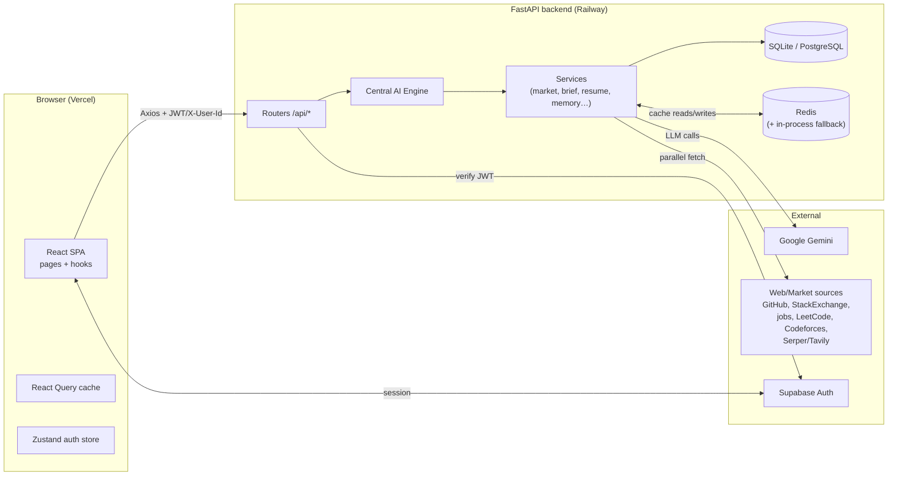
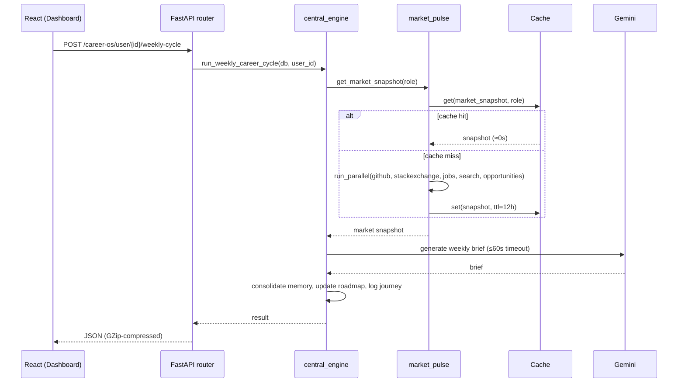

# Delta 2.0 — System Architecture

> Technical reference for how Delta 2.0 is built: the stack, the layers, the data
> model, the API surface, the request lifecycle, and the performance/caching
> design. For the *product* vision see [DELTA_CAREER_OS_BLUEPRINT.md](./DELTA_CAREER_OS_BLUEPRINT.md);
> for setup see the root [README.md](../README.md).

## Table of contents
1. [What Delta is](#1-what-delta-is)
2. [Tech stack](#2-tech-stack)
3. [High-level architecture](#3-high-level-architecture)
4. [Repository layout](#4-repository-layout)
5. [Backend architecture](#5-backend-architecture)
6. [The ten system pillars → code map](#6-the-ten-system-pillars--code-map)
7. [Data model](#7-data-model)
8. [API reference](#8-api-reference)
9. [Request lifecycle](#9-request-lifecycle)
10. [Frontend architecture](#10-frontend-architecture)
11. [Performance & caching architecture](#11-performance--caching-architecture)
12. [External integrations](#12-external-integrations)
13. [Configuration & environment variables](#13-configuration--environment-variables)
14. [Deployment](#14-deployment)
15. [Conventions & non-negotiables](#15-conventions--non-negotiables)

---

## 1. What Delta is

Delta 2.0 is a **Career Intelligence / Career Operating System** for students and
early professionals. The core idea: most students fail not from lack of
motivation but because the path ahead is invisible. Delta makes it visible and
turns it into a personalized weekly journey driven by **AI + live market signals**.

The product is structured around a repeating **Weekly Loop**: read the user's
memory → pull market signals → compare → update the roadmap → generate this
week's plan + a brief.

---

## 2. Tech stack

| Layer | Technology |
|-------|-----------|
| **Frontend** | React 18 (`react@18.3`), Create React App + CRACO (`@craco/craco@7`, `react-scripts@5`), React Router 7, Tailwind CSS 3, Radix UI, Axios 1.8, Zustand 5 (auth), TanStack React Query 5, Framer Motion 12, Recharts 3, sonner (toasts), lucide-react (icons) |
| **Backend** | Python 3.11, FastAPI 0.110, Uvicorn 0.25, SQLAlchemy 2.x (**sync**), Pydantic 2 / pydantic-settings, slowapi (rate limiting) |
| **Database** | SQLite by default (sync driver); PostgreSQL in production (`psycopg2-binary`) |
| **Auth** | Supabase (email/password + Google OAuth) via `@supabase/supabase-js`; backend verifies Supabase JWTs (PyJWT + cryptography) |
| **AI / search** | Google Gemini via `google-genai`; embeddings via a local deterministic **hash-based mock** (`sentence-transformers` was removed to fit the 512 MB Render tier); Tavily / Serper for web search |
| **Cache** | Redis (`redis`) with in-process TTL fallback (`cachetools`) |
| **Email** | Resend (currently stubbed) |
| **Container / deploy** | Docker (backend `Dockerfile`), `docker-compose.yml`; frontend on Vercel, backend on a container host (Railway; dynamic `$PORT`; previously Render) |

> **Important:** the backend uses **synchronous** SQLAlchemy (`create_engine`,
> not the async engine) and synchronous route handlers. See
> [§11](#11-performance--caching-architecture) for how concurrency is handled.

---

## 3. High-level architecture



Every feature routes through the **Central AI Engine**, which reads the user's
memory + market context + journey history *before* generating anything.

---

## 4. Repository layout

```text
delta/
├── backend/                      # FastAPI application
│   ├── app/
│   │   ├── main.py               # App entry: middleware, routers, startup migrations
│   │   ├── config.py             # Settings (env-driven, self-healing .env loader)
│   │   ├── database.py           # Sync SQLAlchemy engine, session, SQLite pragmas
│   │   ├── limiter.py            # slowapi rate limiter
│   │   ├── dependencies/auth.py  # JWT verification, resource-ownership guards
│   │   ├── routers/              # HTTP endpoints (one module per domain)
│   │   ├── services/             # Business logic & integrations (see §5)
│   │   ├── models/               # SQLAlchemy ORM models (one file per area)
│   │   └── schemas/              # Pydantic request/response schemas
│   ├── requirements.txt
│   └── Dockerfile
├── frontend/                     # React (CRA + CRACO) SPA
│   ├── src/
│   │   ├── App.js                # Routes, QueryClient, auth gating, code-splitting
│   │   ├── pages/                # Route pages (Dashboard, WeeklyPlan, Resume…)
│   │   ├── components/           # Landing + ui/ (Radix-based design system)
│   │   ├── hooks/                # React Query hooks (useUser, useScore, useChat)
│   │   ├── store/authStore.js    # Zustand auth state (Supabase session)
│   │   └── lib/api.js            # Axios instance + typed API methods
│   └── vercel.json               # SPA rewrite (all routes → index.html)
├── docs/                         # This file + product blueprint
├── docker-compose.yml
└── README.md
```

---

## 5. Backend architecture

The backend is a layered FastAPI app: **Routers → Central Engine → Services → Models/DB**.

### Layers
- **Routers** (`app/routers/*`) — thin HTTP handlers. They validate input
  (Pydantic schemas), enforce ownership (`dependencies/auth.py`), and delegate to
  services. All handlers are sync `def` (run in Starlette's threadpool).
- **Central AI Engine** (`services/central_engine.py`) — the orchestration core.
  Key entry points: `initialize_career_os_for_user`, `run_weekly_career_cycle`,
  `compile_career_context`, `get_or_create_roadmap_state`, `log_journey_event`,
  `run_memory_consolidation_cycle`. It assembles memory + market + journey and
  drives the other services.
- **Services** (`app/services/*`) — focused units of business logic and external
  integration (see the pillar map in §6).
- **Models** (`app/models/*`) — SQLAlchemy ORM tables (see §7).
- **Schemas** (`app/schemas/*`) — Pydantic models for request/response shapes.

### Cross-cutting infrastructure
| Concern | Where |
|---------|-------|
| LLM access (Gemini, key rotation, timeout) | `services/ai_service.py` |
| Caching (Redis + fallback) | `services/cache.py` |
| Parallel external calls | `services/parallel.py` |
| Embeddings / semantic graph | `services/memory_graph.py`, `models/semantic_memory.py` |
| Auth / ownership | `dependencies/auth.py` |
| Rate limiting | `limiter.py` (`/briefs/generate` 5/hr, `/chat/message` 20/min) |
| CORS + GZip | `main.py` |
| Startup table sync + idempotent migrations | `main.py` `startup()` |

---

## 6. The ten system pillars → code map

The product blueprint defines ten pillars. Each maps to concrete code:

| # | Pillar | Primary code |
|---|--------|--------------|
| 1 | **Adaptive Ingestion** — AI onboarding, not static forms | `services/ingestion_engine_v2.py`, `services/onboarding_pipeline.py`, `routers/ingestion.py` |
| 2 | **Personal Data Vault** — structured per-user profile | `services/profile_store.py`, `services/agent2_memory.py`, `models/career_os.py` (`CareerMemoryProfile`) |
| 3 | **Central AI Engine** — all features route through here | `services/central_engine.py`, `services/ai_service.py`, `services/orchestrator.py` |
| 4 | **Market Pulse** — weekly live market signals | `services/market_pulse.py`, `services/web_search.py`, `services/opportunity_adapters.py`, `services/search_service.py` |
| 5 | **Roadmap** — long-term phases + this week | `central_engine.get_or_create_roadmap_state`, `models/career_os.py` (`RoadmapState`) |
| 6 | **Journey Until Today** — full history log | `models/career_os.py` (`JourneyEvent`), `central_engine.log_journey_event` |
| 7 | **Weekly Loop** — automated weekly cycle | `central_engine.run_weekly_career_cycle`, `services/brief_generator.py`, `services/dossier_generator.py` |
| 8 | **Projects As Proof** — proof-oriented project recs | `services/project_engine.py` |
| 9 | **Portfolio Assessment** — weekly gap analysis | `services/portfolio_engine.py` |
| 10 | **Domain Packs** — per-domain taxonomies | `services/domain_packs.py` |

**Supporting subsystems:** semantic memory graph (`memory_graph.py`,
`memory_consolidation.py`, `tension_resolver.py`, `models/semantic_memory.py`),
Delta Score (`delta_score.py`), resume engine (`resume_parser.py`,
`resume_service.py`), calendar (`calendar_service.py`), ideal frames
(`ideal_frames.py`).

---

## 7. Data model

Sync SQLAlchemy ORM; tables auto-created on startup via
`Base.metadata.create_all`. Most tables key off `user_id` (FK → `users.id`).

| Table | Model file | Role | Key columns / cardinality |
|-------|-----------|------|---------------------------|
| `users` | `user.py` | Account + serialized profile blobs | `id`, `profile_data` (JSON text), `agent2_memory_data` (JSON text), onboarding fields, `created_at` |
| `career_memory_profiles` | `career_os.py` | Structured Career Memory Profile (the Data Vault) | `user_id` **unique** |
| `roadmap_states` | `career_os.py` | Current roadmap (phases + this week's tasks) | `user_id` **unique** |
| `journey_events` | `career_os.py` | Append-only history (tasks, moods, AI decisions) | `user_id` (idx), `event_type`, `created_at` |
| `resume_profiles` | `career_os.py` | Generated/parsed resume state | `user_id` **unique** |
| `market_snapshots` | `market_snapshot.py` | Per-user market pulse snapshot | `user_id` (idx), `snapshot_date` |
| `recommendations` | `recommendation.py` | Proof-project / action recommendations | `user_id` (idx), `status` |
| `delta_scores` | `delta_score.py` | Delta Score history | `user_id` (idx), `created_at` |
| `weekly_briefs` | `weekly_brief.py` | Generated weekly briefs | `user_id` (idx), `created_at` |
| `skill_nodes` | `skill_node.py` | User's skills | `user_id` (idx) |
| `personalization_profiles` | `personalization.py` | Personalization settings | `user_id` **unique** |
| `opportunity_boards` | `opportunity_board.py` | AI-matched jobs/internships board | `user_id` **unique**, `preferences`/`opportunities` (JSON), `profile_signature` |
| `achievements` | `achievement.py` | Trophy-cabinet entries (certs/projects/awards) | `user_id` (idx), `type`, `title`, `organization`, `url` |
| `feedbacks` | `feedback.py` | User feedback submissions | `created_at` |
| `semantic_nodes` / `semantic_edges` / `tension_nodes` | `semantic_memory.py` | Embedding-backed memory graph + detected tensions | `user_id` (idx) |
| `ingestion_sessions` | `semantic_memory.py` | Onboarding/ingestion session state | `user_id` (idx) |

**Composite indexes** (created idempotently on startup for hot ordered queries):
`idx_market_user_date (market_snapshots: user_id, snapshot_date)` and
`idx_journey_user_created (journey_events: user_id, created_at)`.

---

## 8. API reference

All routes are under `/api`. Ownership is enforced via the `X-User-Id` header +
`Authorization: Bearer <supabase-jwt>` (see `dependencies/auth.py`).

| Router | Method | Path | Purpose |
|--------|--------|------|---------|
| **users** | GET | `/users/{user_id}` | Get user |
| | GET | `/users/{user_id}/with-skills` | User + skills (Navbar/profile) |
| | PUT | `/users/{user_id}` | Update user |
| | GET | `/users/{user_id}/stats` | Dashboard stats (role alignment, gaps…) |
| **skills** | GET | `/skills/{user_id}` | List skills |
| | POST | `/skills` | Create skill |
| | PUT | `/skills/{skill_id}` | Update skill |
| | POST | `/skills/{skill_id}/verify` | Verify skill |
| **briefs** | GET | `/briefs/user/{user_id}/latest` | Latest weekly brief |
| | POST | `/briefs/generate/{user_id}` | Generate brief *(LLM; 5/hr)* |
| | GET | `/briefs/scores/{user_id}/current` | Current Delta Score |
| | GET | `/briefs/scores/{user_id}/history` | Score history |
| | POST | `/briefs/recommendations/{rec_id}/complete` | Mark recommendation done |
| **chat** | POST | `/chat/message` | Agent 2 chat / weekly actions *(LLM; 20/min)* |
| | POST | `/chat/stream` | SSE token streaming (general assistant) |
| | GET | `/chat/history/{user_id}` | Chat history |
| | POST | `/chat/onboarding/start` | Start onboarding chat |
| | POST | `/chat/onboarding/finalize` | Finalize onboarding |
| **career-os** | GET | `/career-os/domain-packs` · `/domain-packs/{id}` | Domain packs |
| | GET | `/career-os/system-status` | System status |
| | GET | `/career-os/user/{user_id}/context` | Compiled career context |
| | POST | `/career-os/user/{user_id}/initialize` | Initialize Career OS *(LLM + market)* |
| | POST | `/career-os/user/{user_id}/weekly-cycle` | Run weekly loop *(heaviest; LLM + market)* |
| | POST | `/career-os/user/{user_id}/journey` | Log a journey event |
| | POST | `/career-os/user/{user_id}/consolidate-memory` | Memory consolidation |
| **ingestion** | POST | `/ingestion/start` · `/answer` · `/resume` · `/bridge` · `/complete/{id}` · `/reset/{id}` | Adaptive ingestion pipeline |
| | GET/PUT | `/ingestion/state/{id}` · `/profile/{id}` | Ingestion state/profile |
| **resume** | GET | `/resume/{user_id}` | Get resume |
| | POST | `/resume/{user_id}/generate` · `/upload` · `/apply-suggestions` · `/ats-optimize` | Resume generation/parsing *(LLM)* |
| | GET | `/resume/{user_id}/suggestions` · `/download` | Suggestions / export |
| **calendar** | GET | `/calendar/events` · `/sources` | Calendar events + source statuses |
| **dossier** | GET | `/dossier/weekly/{user_id}` | Weekly dossier |
| **opportunities** | GET | `/opportunities/{user_id}` | Stored prefs + last AI board (no LLM) |
| | PUT | `/opportunities/{user_id}/preferences` | Save opportunity preferences |
| | POST | `/opportunities/{user_id}/generate` | Regenerate AI-matched board *(LLM)* |
| **achievements** | GET/POST/DELETE | `/achievements/{user_id}` · `/{achievement_id}` | Trophy-cabinet CRUD |
| **reminders** | POST | `/reminders/daily` | Send daily task-reminder emails *(secret-protected cron)* |
| **feedback** | GET/POST | `/feedback` | Feedback |

Interactive docs: `http://localhost:8000/docs` (Swagger), `/health`, `/`.

---

## 9. Request lifecycle

Example: the **weekly cycle** (the heaviest path), and a normal **dashboard load**.



Auth on every request: the Axios request interceptor attaches `X-User-Id` +
`Bearer` token; the backend verifies the JWT and checks the resource belongs to
that user (BOLA prevention). A 401 triggers client-side logout + redirect.

---

## 10. Frontend architecture

A CRA + CRACO single-page app. `App.js` wires routing, the React Query client,
auth gating, and route-level code-splitting.

### Routing & gating
- **Public:** `/`, `/about`, `/careers`, `/contact`, `/partners`, `/investors`,
  `/early-access`, `/privacy`, `/terms`, `/login`.
- **Auth only (no onboarding required):** `/onboarding`, `/intake`.
- **Auth + onboarding complete:** `/dashboard`, `/weekly-plan`, `/roadmap`,
  `/progress-report`, `/resume`, `/achievements` (Trophy Cabinet),
  `/opportunities`, `/ledger`, `/briefs`, `/pulse`, `/calendar`, `/portfolio`,
  `/profile`.
- Gating is done by `<RequireAuth>` (checks Zustand `userId`/`loading`) and
  `<ProtectedRoute>` (checks `onboarding_complete`).

### State & data
- **Auth state:** Zustand store (`store/authStore.js`) holds `userId` + JWT,
  persisted to `localStorage`, synced from Supabase `getSession()` on boot.
- **Server state:** TanStack React Query. The `QueryClient` (in `App.js`) sets
  global `staleTime: 60s` + `gcTime: 5m` so navigation doesn't refetch slow
  endpoints. Hooks live in `hooks/` (`useUser`, `useScore`, `useChat`).
- **API client:** `lib/api.js` — a single Axios instance (90s default timeout)
  with request/response interceptors, exposing typed method groups
  (`usersAPI`, `briefsAPI`, `chatAPI`, `careerOSAPI`, `resumeAPI`, …).

### Rendering
- Route pages are loaded with `React.lazy` + `<Suspense>` → each ships as a
  separate chunk (smaller initial bundle, faster first paint).
- Design system: `components/ui/*` (Radix primitives styled with Tailwind),
  `GlassPanel`, `Navbar`; animations via Framer Motion; charts via Recharts.

---

## 11. Performance & caching architecture

The app's latency is dominated by **external API calls** (Gemini + live market
scraping). The performance design keeps the backend **synchronous** (no async
rewrite) and attacks latency on three fronts.

### a) Parallelism — `services/parallel.py`
`run_parallel({name: callable}, timeout, default)` fans independent blocking
calls out across a `ThreadPoolExecutor` and collects results by name, failing
soft (a task that errors/times out yields its `default`). Applied to:
- `market_pulse.get_market_snapshot` — GitHub, StackExchange, jobs, web search,
  and opportunities run **concurrently** (was ~30–50s sequential → ~max single
  source, ≈3s cold in practice).
- `web_search.search_for_market_pulse` — its 4 queries run concurrently.
- `opportunity_adapters.collect_opportunities` — all adapters fetch concurrently.

### b) Caching — `services/cache.py`
A shared cache with a **fail-open** design:
- Backed by **Redis** (`REDIS_URL`); on any connection error it transparently
  falls back to a per-process `cachetools.TTLCache`. **The app runs identically
  whether or not Redis is available** (Redis has no native Windows build, so
  locally it just uses the fallback).
- API: `cache_get`, `cache_set`, and a `@cached(namespace, ttl, key_fn)`
  decorator. Keys are `delta:{namespace}:{sha1(key)}`. Empty/falsy results are
  **not** cached (treated as transient).

| What is cached | Namespace | TTL | Why safe |
|----------------|-----------|-----|----------|
| Market snapshot (by role) | `market_snapshot` | 12h | Role-scoped, not per-user; market moves slowly |
| Web search results (by query) | `web_search` | 6h | Deterministic-ish, slow-moving |
| Embeddings (by text) | `embedding` | 30d | Deterministic |
| Intent classification only | `intent` | 1h | Deterministic routing decision (low temp) |

> **Never cached:** personalized generative output — weekly briefs, chat answers,
> resume generation. These must stay fresh per request.

### c) DB & server tuning
- **SQLite:** WAL journal mode + `busy_timeout` + `synchronous=NORMAL` (via a
  `connect` event listener in `database.py`) so readers don't block on a writer.
- **Pooling:** `pool_pre_ping=True`; for Postgres, `pool_size`/`max_overflow`/
  `pool_recycle`.
- **Indexes:** composite indexes for the hot ordered queries (see §7).
- **GZip:** `GZipMiddleware` compresses responses > 1 KB (≈90% smaller for large
  JSON like career context / OpenAPI).
- **LLM timeout:** Gemini client bounded to 60s so a hung call fails fast.

### d) Frontend perceived latency
- Global React Query `staleTime`/`gcTime` (cross-navigation reuse).
- Optimistic task actions on the Dashboard refresh only stats + context instead
  of re-firing all 7 dashboard calls.
- Route-level code-splitting; Axios default timeout lowered to 90s (the long
  weekly-cycle call keeps a 300s override).

---

## 12. External integrations

| Service | Used for | Module | Notes |
|---------|----------|--------|-------|
| **Google Gemini** | All LLM generation | `ai_service.py` | Up to 5 API keys in round-robin; rotates on 429/quota; 60s timeout. Default model `gemma-4-31b-it`; `gemini-2.5-flash` **only** for resume analysis (see §15) |
| **Local embeddings** | Embeddings (memory graph) | `memory_graph.py` | Deterministic hash-based mock, 384-dim, in-process (no data leaves). `sentence-transformers` removed for the 512 MB tier; real-model path (with 30d cache) still present |
| **Tavily / Serper** | Web search | `web_search.py` | Provider waterfall → mock fallback |
| **GitHub / StackExchange / Arbeitnow** | Market signals | `market_pulse.py` | Public APIs, each timeout-bounded |
| **LeetCode / Codeforces / Kaggle / Unstop / Devpost** | Opportunities | `opportunity_adapters.py` | Public APIs / scrapers |
| **Supabase** | Auth (email/password, Google OAuth) | FE `store/authStore.js`, BE `dependencies/auth.py` | JWT verified server-side |
| **Gmail SMTP** | Daily reminder emails | `email_service.py` | Sends via `smtp.gmail.com`; triggered by the `/reminders/daily` cron |
| **Redis** | Shared cache | `cache.py` | Optional; fail-open fallback |

---

## 13. Configuration & environment variables

### Backend (`backend/.env`)
| Var | Default | Purpose |
|-----|---------|---------|
| `DATABASE_URL` | `sqlite:///./delta.db` | DB connection. `sqlite+aiosqlite://` is auto-converted to sync. Use Postgres URL in prod. |
| `GEMINI_API_KEY` … `GEMINI_API_KEY_5` | — | Gemini keys (round-robin) |
| `GEMINI_MODEL` | `gemma-4-31b-it` | Default LLM model (do not change without approval) |
| `REDIS_URL` | `redis://localhost:6379/0` | Shared cache; falls back to in-process if unreachable |
| `CACHE_ENABLED` | `true` | Master switch for caching |
| `TAVILY_API_KEY` / `SERPER_API_KEY` | — | Web search providers |
| `SUPABASE_URL` / `SUPABASE_SERVICE_ROLE_KEY` / `SUPABASE_JWT_SECRET` | — | Auth / JWT verification |
| `REMINDER_FROM_EMAIL` / `REMINDER_FROM_PASSWORD` / `REMINDER_SECRET` | — | Gmail SMTP creds + cron-protection secret for `/reminders/daily` |
| `FRONTEND_URL` | `https://delta-ai.vercel.app` | Link target in reminder emails |
| `SQL_ECHO` | `false` | Log all SQL |
| `OPPORTUNITY_SOURCE_MODE` (+ `LEETCODE_`, `CODEFORCES_`, `KAGGLE_`, `UNSTOP_`, `HACKATHON_`, `JOBPOSTS_`) | `mock` | Live vs mock adapters |

### Frontend (`frontend/.env`)
| Var | Purpose |
|-----|---------|
| `REACT_APP_API_URL` | Backend base URL (defaults to `http://localhost:8000/api`) |
| `REACT_APP_SUPABASE_URL` / `REACT_APP_SUPABASE_ANON_KEY` | Supabase client |
| `SKIP_PREFLIGHT_CHECK` | CRA/CRACO build flag |

> No new **required** env vars were introduced by the cache layer — `REDIS_URL`
> and `CACHE_ENABLED` have safe defaults.

---

## 14. Deployment

- **Frontend → Vercel.** Project root is `frontend/`; `vercel.json` rewrites all
  routes to `index.html` (SPA). Build: `npm run build` (`craco build`). Vercel
  builds with `CI=true`, so **lint warnings fail the build** — keep the tree
  warning-clean. Pushes to `main` auto-deploy.
- **Backend → container host (Railway; previously Render).** Built from
  `backend/Dockerfile` (`python:3.11-slim`, installs `requirements.txt`, runs
  Uvicorn on dynamic `$PORT`). Production DB is Postgres (so the SQLite-only WAL
  path is skipped; pooling + index creation apply instead). **The backend must
  be redeployed separately** to pick up
  backend changes / new dependencies.
- **Redis (optional).** Provision a managed Redis and set `REDIS_URL` for a
  shared cache across instances/restarts; otherwise each instance uses its own
  in-process fallback.
- **Local:** `docker-compose up --build` (backend) + `npm start` (frontend), or
  run each manually per the [README](../README.md).

---

## 15. Conventions & non-negotiables

From the product blueprint and `CLAUDE.md`:

- **Never** store user understanding as raw chat only — always structured profiles.
- **Never** generate a roadmap without market context.
- **Never** generate weekly advice without reading journey history.
- Prefer fewer, stronger projects over many weak ones.
- **AI model selection is fixed** (`CLAUDE.md` §5): `gemma-4-31b-it` is the
  default for everything; `gemini-2.5-flash` is used **only** for resume
  analysis. Do not introduce new model strings or change models "for speed"
  without explicit approval.
- Respect the **synchronous** SQLAlchemy engine — do not introduce the async
  engine piecemeal.
- Cache only deterministic/idempotent work; never cache personalized generative
  output.
- **Git workflow** (`CLAUDE.md` §6): pull `main` before changes; never push
  unless explicitly told; surface merge conflicts instead of auto-resolving.
```
